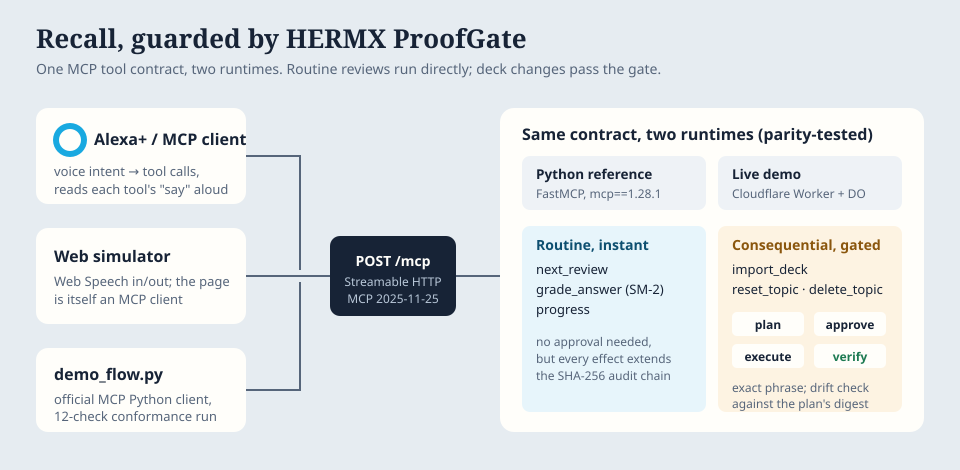

# Recall, guarded by HERMX ProofGate

**A voice study coach for Alexa+ where routine reviews run instantly and anything that changes a deck waits for your exact approval.**

- **Live demo (free, no sign-in):** https://hermx-proofgate-recall.senih-bayankulu25.workers.dev
- **Live MCP endpoint:** `https://hermx-proofgate-recall.senih-bayankulu25.workers.dev/mcp` (Streamable HTTP, protocol `2025-11-25`)
- **Demo video:** see the Devpost project page
- Built for **Build, Ship, Shape: Amazon Developer Hackathon**, Alexa+ track, and released under MIT (Open Source mini challenge).



## The idea

Voice assistants are becoming agents: they don't just answer, they change things. Most changes are small and reversible, and asking for confirmation on every one would make a voice product unbearable. A few changes are consequential, and an agent must never treat "yeah, go ahead" as authorization for those.

Recall is a hands-free spaced-repetition coach that makes this split explicit:

| Tier | Tools | Rule |
| --- | --- | --- |
| Routine | `next_review`, `grade_answer`, `progress` | Runs immediately. Every effect still extends a SHA-256 audit chain. |
| Consequential | `plan_change` → `approve_change` → `execute_change` → `verify_change` for `import_deck`, `reset_topic`, `delete_topic` | Nothing happens until the user says the plan's exact phrase, for example "approve 7 F 3 A 9 C". Execution re-checks the topic's digest and fails closed if it changed after planning. Verification compares the result with the digest predicted at plan time. |

`proofgate_status` exposes the contract, the audit-chain head and the current state digest.

## What happens in a session

1. "Learn this as mcp" creates a **plan**: Recall reads the text, builds cloze flashcards, and predicts the topic's SHA-256 digest after the import. Nothing is written yet.
2. "Yes, go ahead" is rejected (`APPROVAL_MISMATCH`), and the rejection is logged.
3. "Approve 7 F 3 A 9 C" approves that one plan. Recall re-checks the topic, imports, then **verifies** the result against the predicted digest.
4. "Quiz me" and spoken answers are graded (SM-2 scheduling) without confirmation prompts.
5. If a deck changes between planning and execution (for example, you review a card after asking for a reset), the old approval is refused with `STATE_DRIFT`.

## Repository

| Path | What it is |
| --- | --- |
| `server.py` | Python reference MCP server (official MCP Python SDK 1.28.1, FastMCP), Streamable HTTP at `/mcp`, and the simulator UI at `/` |
| `proofgate_core.py` | The gate: risk tiers, plan-bound approval, drift check, verification, hash-chained audit |
| `learning.py`, `srs.py` | Deterministic cloze-card extraction, spoken-answer grading, SM-2 scheduling |
| `worker/` | Cloudflare Worker port used for the free live demo (Durable Object sandbox per visitor) |
| `web/` | Alexa+ experience simulator; the page itself is an MCP client of `/mcp` |
| `demo_flow.py` | 12-check conformance run using the official MCP Python client |
| `tests/` | Safety and effect-boundary tests, plus a Python/JavaScript parity test |

Card extraction is deterministic (no LLM, no network), which is what lets the server predict the post-change digest at plan time.

## Run locally

Requirements: Python 3.11+, optionally Node.js for the parity test.

```bash
python -m venv .venv
# Windows: .venv\Scripts\activate    macOS/Linux: source .venv/bin/activate
pip install -e ".[dev]"
python server.py            # MCP at http://127.0.0.1:8767/mcp, simulator at http://127.0.0.1:8767/
```

Verify:

```bash
pytest -q                                              # 16 tests
python demo_flow.py                                    # against the local server
python demo_flow.py --url "https://hermx-proofgate-recall.senih-bayankulu25.workers.dev/mcp?sandbox=my-test"
```

Any MCP client works; for example, point the MCP Inspector at the live `/mcp` URL with the Streamable HTTP transport. Add `?sandbox=<name>` to get your own isolated state.

## Deploy your own live demo (Cloudflare free plan)

```bash
cd worker
npx wrangler deploy
```

The Worker serves `web/` as static assets and handles `/mcp` itself: stateless JSON-RPC over Streamable HTTP (JSON response mode, no server-initiated SSE), one SQLite-backed Durable Object per sandbox.

## What is and isn't claimed

- Claimed and verified: a self-hosted MCP server on protocol `2025-11-25` over Streamable HTTP, discoverable tools, the gate behaviour above, and the same behaviour on the live Worker (see [EVIDENCE.md](EVIDENCE.md)).
- Not claimed: a completed connection inside the production Alexa+ app. The simulator stands in for Alexa+'s voice layer, which the track explicitly allows.
- Not entered: the AWS Builder mini challenge. This build uses no AWS services.

## Commercial boundary

Clean-room code written during the hackathon. It contains no HERMX commercial control-plane source, credentials, customer data, private provider mappings or deployment secrets. See [SECURITY.md](SECURITY.md).

The learning-coach half began as a separate prototype, [senih25/recall-alexa-mcp](https://github.com/senih25/recall-alexa-mcp), and was merged here so the submission is one product.
